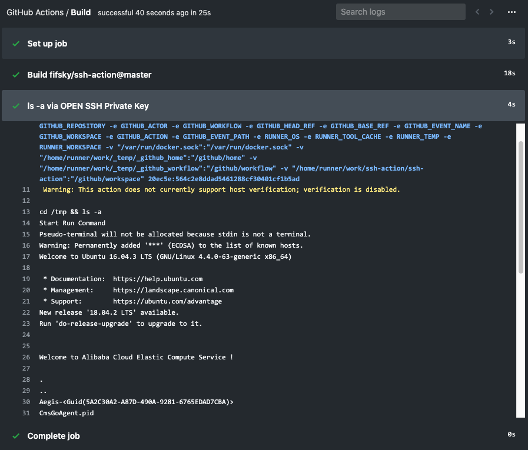

# Remote SSH Commands


Simple GitHub Action to run a command on a remote server using SSH. This is working with the latest [GitHub Actions](https://github.com/features/actions).

⭐️ SSH password are supported from version 0.0.3

## ✨ Example Usage

**Example using OpenSSH private key**

```yml
- name: ls -a via ssh
  uses: fifsky/ssh-action@master
  with:
    command: |
      cd /tmp
      ls -a
    host: ${{ secrets.HOST }}
    user: root
    key: ${{ secrets.PRIVATE_KEY}}
```

🔐 Set your secrets here: `https://github.com/USERNAME/REPO/settings/secrets`.

Check out [the workflow example](.github/workflows/test.yml) for a minimalistic yaml workflow in GitHub Actions.

**Result**



## Options

- **host** - _string_ - Hostname or IP address of the server. **Default:** `'localhost'`

- **port** - _integer_ - Port number of the server. **Default:** `22`

- **user** - _string_ - Username for authentication. **Default:** (root)

- **key** - _string_ - Required, that contains a private key for either key-based or hostbased user authentication (OpenSSH format). **Default:** (none)

- **pass** - _string_ - Password for authentication. 

- **args** - _string_ - SSH parameters for example: -tt.

> Password and Private Key can only be configured one item


If you need to add some extra SSH parameters, you can setting the args option.

For example, add `-tt` parameter to solve: https://github.com/fifsky/ssh-action/issues/4

```
Pseudo-terminal will not be allocated because stdin is not a terminal.
```

## Tips

If emitting "mesg: ttyname failed: Inappropriate ioctl for device", You need to modify your Linux files as follows

```
vim /root/.profile
// Modify the "mesg n || true"  to "tty -s && mesg n || true"
```


## Thanks

Documentation and parameters design from:
https://github.com/garygrossgarten/github-action-ssh
